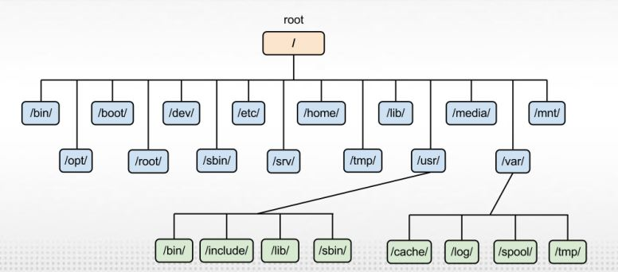

# Topics covered
<ul>

<li>

#### <a href="#kernel">What is linux kernel?</a>
</li>
<li>

#### <a href="#GNU">GNU</a>
</li>
<li>

#### <a href="shell">Shells</a>
</li>
<li>

#### <a href="#CLI">Command Line Interface (CLI)</a>
</li>
<li>

#### <a href="#term">Terminal</a>
</li>
<li>

#### <a href="#tree">Linux Directory Hierarchy</a>
</li>
<li>

#### <a href="#BSC">Bash Shell Commands</a>
</li>

</ul>

#

the first linux kernel was invented by Linus
Torvalds.
  
The kernel is the core of linux system, it's a program running all the time in the background and it's the first program to run when we start up the computer when the boatstrap starts and loads it into the RAM then the function init() or system() is called and loaded into the virtual memory to be the parent of all upcoming processes which will run on our OS that's how it has the control over all the processes running on our OS.
  
kernel is responsible for 4 main functions:
<ul>
<li>System memory management: it can create virtual memory not only our physical memory.</li>
<li>Software program management: it manages all the processes running on the OS, for instance it manages whether the process will run on foreground or background, when the process is supposed to wait and when it will back to the running state as the process scheduler is a core part of the kernel in linux.</li>
<li>Hardware management: each device has a driver code saved inside the kernel and whenever the kernel needs to communicate with that divice it uses that code, also the kernel is responsible for allocating the resources required by each process to it.</li>
<li>Filesystem management: linux kernel supports many file systems.</li>
</ul>

#

GNU stands for GNU’s Not Unix.
 
GNU organization supports OSS(open source software) to allow programmers to develop and release software without any licensing fees, anyone can use, test, update and develop new releases of software without license so it's completly free.

#

Shell is one of the most important part in any linux OS, we can deal with the shell using the terminal as we can consider the terminal is the program takes commands from the user as input and give it to the shell then the shell executes this command and returns the result to terminal to be viewed to the user.
  
we can consider the shell as the core command prompt so users can use it to execute any sort of operations as he knows the command and has the privelege to execute it.
  
there're many types of shells supported by linux OSs.

### Standard Shells :
<ul>
<li>Bourne Shell(sh): the first shell invented with unix's start, it was a very simple shell in which all variables are strings. </li>
 
<li>C shell(csh): it was inveted after Bornue shell and it's very efficient as it can deal with a lot of variables types and OS jobs and processes and it keeps commands history. it has just 1 problem, commands and programs on this shell are following C language syntax.</li>
 
<li>Korn Shell(ksh): it was invented after the C shell with more capabilities and it solved the problem of C shell, the commands became more easy and clear but it has another problem as we're writing on the prompt using vi which is not user friendly.</li>
 
<li>Bash Shell (Bourne-Again SHell): it took all the advantags of KSH and made dealing with the shell as easy as dealing with bourne shell and by the time they're adding new features to it.</li>
</ul>

#

CLI was the only way to deal with the earlier versions of Unix and Linux we just have the command prompt and the only input device is the keyboard so these systems had many restrictions because they had no GUI but also that made CLI have commands for every operation can be done in an easy way.
  
When new versions of linux with GUI were released such as Ubuntu they noticed they implemeted the terminal in it to allow users to deal with the shell (linux console) and as we know in many operations we prefer to do it using commands because GUI actually freed us from restriction of using different input devices and getting output in a fancy way but it also ristrict us to use only around 10% of system capabilities and options.
  
So after linux releases included the GUI they also provided the terminal to access the CLI.

#

GNOME's terminal is the latest version. 
To access GNOME's tetminal press: Ctrl + Alt + T, or you can just run it throuth the GUI. 
Important shortcuts can be used with terminal:
<ul>
<li>Ctrl + Shift + C: Copy.</li>
<li>Ctrl + Shift + V: Paste.</li>
<li>Ctrl + C: to break out of command or process and stop it.</li>
<li>Ctrl + Z: to send the current running process that is holding the terminal to background.</li>
<li>Ctrl + D: it will log you out of the current terminal. If you are using an SSH connection, it will be closed and If you are using a terminal directly, the application will be closed immediately.</li>
</ul>

#

### Directory hierarchy.
 
  
<table border="2px">
<tr>
<th>Directory</th>
<th>Description</th>
</tr>
<tr>
<td>/</td>
<td>root directory.</td>
</tr>
<tr>
<td>/bin</td>
<td>contains user level commands as executable programs available in order to attain minimal functionality for the purposes of booting and repairing system.</td>
</tr>
<tr>
<td>/boot</td>
<td>contains the boot files.</td>
</tr>
<tr>
<td>/dev</td>
<td>that's where linux creates file for each device.</td>
</tr>
<tr>
<td>/etc</td>
<td>contains system configuration files.</td>
</tr>
<tr>
<td>/home</td>
<td>contains directories for each user of the system.</td>
</tr>
<tr>
<td>/lib</td>
<td>contains system and application library files.</td>
</tr>
<tr>
<td>/media</td>
<td rowspan="2">that's where mount points of removable media are created.</td>
</tr>
<tr>
<td>/mnt</td>
</tr>
<tr>
<td>/opt</td>
<td>that's where 3rd party software and data files are stored.</td>
</tr>
<tr>
<td>/var</td>
<td>contains the files and directories which their size changes dramatically such as log files.</td>
</tr>
<tr>
<td>/usr</td>
<td> consists of several subdirectories that contain additional UNIX commands and data files.</td>
</tr>
<tr>
<td>/tmp</td>
<td> consists temporary files such as the files stored by the browser or the server for a little time and the files in this directory are usually distroyed in different periods.</td>
</tr>
<tr>
<td>/proc</td>
<td>contains the running processes and its information.</td>
</tr>
<tr>
<td>/sbin</td>
<td>contains admin-level commands as executable programs.</td>
</tr>
<tr>
<td>/run</td>
<td>contains runtime data during system operation.</td>
</tr>
<tr>
<td>/srv</td>
<td>that's where local services store there files.</td>
</tr>
<tr>
<td>/sys</td>
<td>contains hardware information files.</td>
</tr>
</table>

#

bash shell has manual which has information about every command and some system files like passwd, shadow, group, etc. 
The main sections of the manual:  
<ul>
<li>Name: it contains command name and description.</li>
<li>Synopsis: shows command syntax.</li>
<li>Description: general description of the command.</li>
<li>Options.</li>
<li>Return Value.</li>
</ul>
If you can't remember some command use man -k with a keyword, for instance if that command is dealing with terminal just type: man -k terminal.
  
manual has different sections which have numbers 1 to 9, we can write the section number after man keyword to access it and if you don't write any number then it's 1 by default.
commands example:
<ul>
<li>man passwd</li>
<li>man 1 passwd</li>
<li>man 5 passwd</li>
</ul>
-the first and second commands are the same and it'll show the man page of passwd command. 
-the third command will show you the man page of the passwd file in (/etc/passwd).
  

### Sections of man page
<table border="2px">
<tr>
<th>Section number</th>
<th>Description</th>
</tr>
<tr>
<td>1</td>
<td>shell commands, and programs.</td>
</tr>
<tr>
<td>2</td>
<td>sys calls.</td>
</tr>
<tr>
<td>3</td>
<td>lib calls.</td>
</tr>
<tr>
<td>4</td>
<td>special files.</td>
</tr>
<tr>
<td>5</td>
<td>descripes file format and it deals with system files.</td>
</tr>
<tr>
<td>6</td>
<td>Games manual.</td>
</tr>
<tr>
<td>7</td>
<td>System adminstration commands, eg: root commands.</td>
</tr>
<tr>
<td>9</td>
<td>kernel related.</td>
</tr>
</table>
  

### Basic commands
<table border="2px">
<tr>
<th>Section number</th>
<th>Description</th>
</tr>
<tr>
<td>cd + (relative or absolute directory path)</td>
<td>changes the working directory to that path.</td>
</tr>
<tr>
<td>cd</td>
<td rowspan="3">changes the directory to user's home directory.</td>
</tr>
<tr>
<td>cd ~</td>
</tr>
<tr>
<td>cd /home/_my user name(login)_</td>
</tr>
<tr>
<td>pwd</td>
<td>print working directory (current directory).</td>
</tr>
<tr>
<td>ls</td>
<td>basic listing, list the contents of current directory.</td>
</tr>
<tr>
<td>ls + (absolute or relative path of directory)</td>
<td>list the contents of the given directory.</td>
</tr>
<tr>
<td>ls -l</td>
<td>option -l is used for more information such as file or dir type, permissions, its owner and group, creation date and last modification date.</td>
</tr>
<tr>
<td>ls -a</td>
<td>option -a shows the current directory contents including hidden files</td>
</tr>
<tr>
<td>ls -R</td>
<td>option -R means recursive listing lists the contents and for directories it lists its contents.</td>
</tr>
<tr>
<td>ls -R</td>
<td>option -R means recursive listing lists the contents and for directories it lists its contents.</td>
</tr>
</table>

